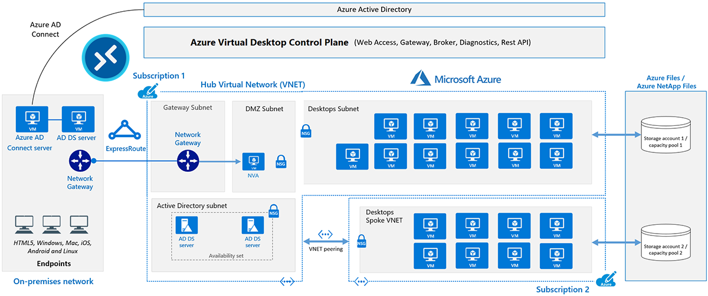
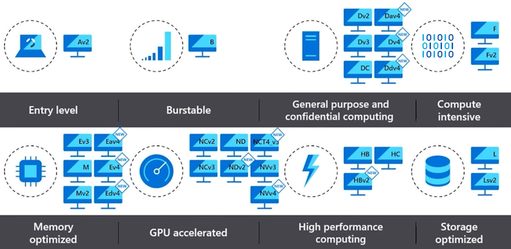
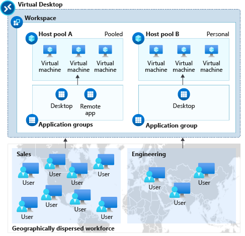
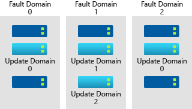
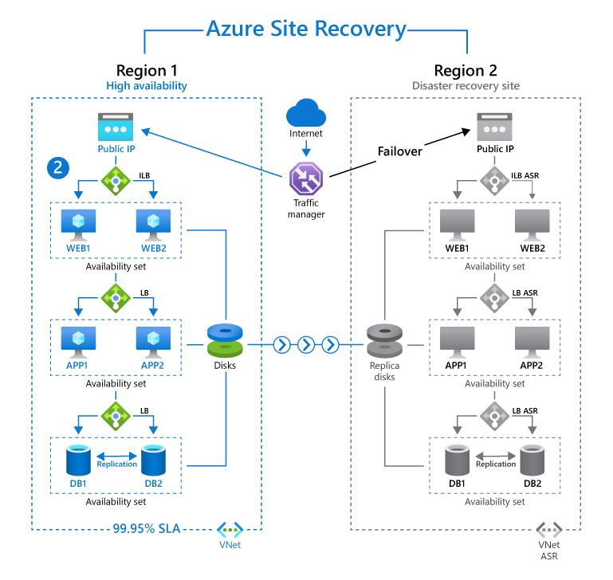

# AZ-140: Azure Virtual Desktop Speciality - MSLearn notes

## Index

- [AZ-140: Azure Virtual Desktop Speciality - MSLearn notes](#az-140-azure-virtual-desktop-speciality---mslearn-notes)
  - [Index](#index)
  - [Plan Azure Virtual Desktop implementation](#plan-azure-virtual-desktop-implementation)
    - [Architecture](#architecture)
      - [Components](#components)
      - [Limitations](#limitations)
      - [Virtual Machine Sizing](#virtual-machine-sizing)
        - [Recommendations - VM Sizing](#recommendations---vm-sizing)
    - [Design the architecture](#design-the-architecture)
      - [Network capacity and speed requirements](#network-capacity-and-speed-requirements)
        - [Applications](#applications)
        - [Display](#display)
      - [Balancing host pools](#balancing-host-pools)
    - [Design for user identities and profiles](#design-for-user-identities-and-profiles)
      - [Supported identity scenarios: User profiles](#supported-identity-scenarios-user-profiles)
      - [Licensing and supported Operating systems](#licensing-and-supported-operating-systems)
      - [Recommend an appropriate storage solution](#recommend-an-appropriate-storage-solution)
        - [FSLogix Profiles](#fslogix-profiles)
          - [Storage options comparison for FSLogix](#storage-options-comparison-for-fslogix)
          - [Storage recommendations - User profiles](#storage-recommendations---user-profiles)
        - [Applications (App Attach)](#applications-app-attach)
          - [Recommendations (App Attach)](#recommendations-app-attach)
      - [Plan for desktop client deployment](#plan-for-desktop-client-deployment)
        - [Clients](#clients)
        - [Workspaces](#workspaces)
  - [Business continuity and disaster recovery](#business-continuity-and-disaster-recovery)
    - [BCDR plan](#bcdr-plan)
      - [Host pools](#host-pools)

## Plan Azure Virtual Desktop implementation

### Architecture

#### Components

- **Host pools** - Host pools are a collection of one or more identical virtual machines (VMs) within Azure Virtual Desktop environments. Each host pool can contain an app group that users can interact with as they would on a physical desktop. Users obtain access to host pools by being allocated to a host pool using an assigned Application Group. There are two types of host pools.
  - **Pooled:** You can configure a pooled host pool for several users to sign in and share a VM. Typically, none of those users would be a local administrator on the pooled VM. With pooled, you can use one of the recommended images that includes Windows 10 Enterprise multi-session. This operating system is exclusive to Azure Virtual Desktop. You can also use your own custom image. Pooled desktop solutions assign users to whichever session host is currently available, depending on the load-balancing algorithm. Because the users don't always return to the same session host each time they connect, they have limited ability to customize the desktop environment and don't usually have administrator access.
  - **Personal:** A personal host pool is where each user has their own dedicated VM. Those users would typically be local administrators for the VM. This enables the user to install or uninstall apps without impacting other users. Personal desktop solutions (sometimes called persistent desktops) allow users to always connect to the same specific session host. Users can typically modify their desktop experience to meet personal preferences, and save files in the desktop environment. Personal desktop solutions:
    - Let users customize their desktop environment, including user-installed applications and saving files within the desktop environment.
    - Allow assigning dedicated resources to a specific user, which can be helpful for some manufacturing or development use cases.

#### Limitations

| **Azure Virtual Desktop object** | **Per Parent container object**  | **Service limit** |
|----------------------------------|----------------------------------|-------------------|
| Workspace                        | Microsoft Entra tenant           | 1300              |
| HostPool                         | Workspace                        | 400               |
| Application group                | Microsoft Entra tenant           | 500               |
| RemoteApp                        | Application group                | 500               |
| Role assignment                  | Any Azure Virtual Desktop object | 200               |
| Session host                     | HostPool                         | 10,000            |

#### Virtual Machine Sizing

VM sizing is an important consideration when you deploy Azure Virtual Desktop. Sizing directly affects your cost and end-user experience. Sizing also determines which workloads run smoothly. The overall goal is to right-size your VMs by looking at factors like the resource requirements of your workload and whether you use personal or pooled host pools. It's also preferable to use a larger number of smaller VMs than to use a few large VMs, because it's easier to manage and maintain smaller VMs. For detailed information about VM sizing, see Session host virtual machine sizing guidelines.

Scaling plans provide an efficient way of using small, low-user-density VMs. A scaling plan automatically adjusts the number of VMs based on user demand and schedule. This approach reduces costs by turning off unused VMs. It optimizes resources by matching host pool capacity with user sessions. For more information, see Autoscale scaling plans and example scenarios in Azure Virtual Desktop.

When you select an operating system disk for Azure Virtual Desktop, you can save costs by selecting a standard hard-disk drive (HDD) over a solid-state drive (SSD), but you sacrifice performance. If your production workload requires a service-level agreement (SLA), you should use premium SSD storage.

Another consideration is that Azure VMs have I/O operations per second (IOPS) and throughput performance limits that are based on the VM type and size. The selected SKU of operating system disks and data disks ultimately determines the IOPS that are available to the user. If you use FSLogix profiles, you have extra IOPS requirements, because the profiles are pulled from network shares and written to disk. For detailed information about IOPS and disk performance, see Scalability and performance targets for VM disks.

##### Recommendations - VM Sizing

- Examine the CPU, GPU, memory, and storage usage of the workloads that your users run before you select a VM SKU.
- Use VMs with at least two physical CPU cores for single-session hosts.
- Use VMs with at least four cores for multiple-session hosts.
- Use a larger number of smaller VMs instead of a few large VMs.
- Use scaling plans to adjust your number of VMs based on user demand and schedule.
- Take into account the IOPS and throughput performance limits of your VMs when you select a disk type.
- Use SSDs for high-performance workloads.
- Use premium SSDs for production workloads that require high performance, low latency, and an SLA.
- Use premium SSDs for Windows 10 or Windows 11 Enterprise Multi-Session.
- Use standard or premium SSDs for personal desktops.

### Design the architecture

#### Network capacity and speed requirements

##### Applications

| **Workload type** | **Recommended bandwith** |
|-------------------|--------------------------|
| Light             | 1.5 Mbps                 |
| Medium            | 3 Mbps                   |
| Heavy             | 5 Mbps                   |
| Power             | 15 Mbps                  |

##### Display

| **Typical display resolutions at 30 fps** | **Recommended bandwidth** |
|-------------------------------------------|---------------------------|
| About 1024 × 768 px                       | 1.5 Mbps                  |
| About 1280 × 720 px                       | 3 Mbps                    |
| About 1920 × 1080 px                      | 5 Mbps                    |
| About 3840 × 2160 px (4K)                 | 15 Mbps                   |

#### Balancing host pools

The following load-balancing methods are available in Azure Virtual Desktop:

- **Breadth-first load balancing** allows you to evenly distribute user sessions across the session hosts in a host pool.
- **Depth-first load balancing** allows you to saturate a session host with user sessions in a host pool. Once the first session reaches its session limit threshold, the load balancer directs any new user connections to the next session host in the host pool until it reaches its limit, and so on.

### Design for user identities and profiles

#### Supported identity scenarios: User profiles

| **Identity scenario**                                        | **Session hosts**                         | **User accounts**                                                       |
|--------------------------------------------------------------|-------------------------------------------|-------------------------------------------------------------------------|
| Microsoft Entra ID + AD DS                                   | Joined to AD DS                           | In Microsoft Entra ID and AD DS, synchronized                           |
| Microsoft Entra ID + AD DS                                   | Joined to Microsoft Entra ID              | In Microsoft Entra ID and AD DS, synchronized                           |
| Microsoft Entra ID + Microsoft Entra Domain Services         | Joined to Microsoft Entra Domain Services | In Microsoft Entra ID and Microsoft Entra Domain Services, synchronized |
| Microsoft Entra ID + Microsoft Entra Domain Services + AD DS | Joined to Microsoft Entra Domain Services | In Microsoft Entra ID and AD DS, synchronized                           |
| Microsoft Entra ID + Microsoft Entra Domain Services         | Joined to Microsoft Entra ID              | In Microsoft Entra ID and Microsoft Entra Domain Services, synchronized |
| Microsoft Entra-only                                         | Joined to Microsoft Entra ID              | In Microsoft Entra ID                                                   |

#### Licensing and supported Operating systems

| **Operating system (64-bit only)**                                                                                  | **Licensing method (Internal commercial purposes)**                                                                                             | **Licensing method (External commercial purposes)**                                                                                   |
|---------------------------------------------------------------------------------------------------------------------|-------------------------------------------------------------------------------------------------------------------------------------------------|---------------------------------------------------------------------------------------------------------------------------------------|
| Windows 11 Enterprise multi-session Windows 11 Enterprise Windows 10 Enterprise multi-session Windows 10 Enterprise | Microsoft 365 E3, E5, A3, A5, F3, Business Premium, Student Use Benefit Windows Enterprise E3, E5 Windows Education A3, A5 Windows VDA per user | Per-user access pricing by enrolling an Azure subscription.                                                                           |
| Windows Server 2022 Windows Server 2019 Windows Server 2016                                                         | Remote Desktop Services (RDS) Client Access License (CAL) with Software Assurance (per-user or per-device) RDS User Subscription Licenses.      | Windows Server 2022 RDS Subscriber Access License (SAL).Per-user access pricing isn't available for Windows Server operating systems. |

#### Recommend an appropriate storage solution

##### FSLogix Profiles

To use [FSLogix Profile Container](https://learn.microsoft.com/en-us/fslogix/configure-profile-container-tutorial) when joining your session hosts to Microsoft Entra ID, you need to [store profiles on Azure Files](https://learn.microsoft.com/en-us/azure/virtual-desktop/create-profile-container-azure-ad) or [Azure NetApp Files](https://learn.microsoft.com/en-us/azure/virtual-desktop/create-fslogix-profile-container) and your user accounts must be hybrid identities. You must create these accounts in AD DS and synchronize them to Microsoft Entra ID. To learn more about deploying FSLogix Profile Container with different identity scenarios, see the following articles:

- [Set up FSLogix Profile Container with Azure Files and Active Directory Domain Services or Microsoft Entra Domain Services.](https://learn.microsoft.com/en-us/azure/virtual-desktop/fslogix-profile-container-configure-azure-files-active-directory)
- [Set up FSLogix Profile Container with Azure Files and Microsoft Entra ID.](https://learn.microsoft.com/en-us/azure/virtual-desktop/create-profile-container-azure-ad)
- [Set up FSLogix Profile Container with Azure NetApp Files](https://learn.microsoft.com/en-us/azure/virtual-desktop/create-fslogix-profile-container)

###### Storage options comparison for FSLogix

| **Features**            | **Azure Files**                                                                        | **Azure NetApp Files**                                                                                                                                                                                                          |
|-------------------------|----------------------------------------------------------------------------------------|---------------------------------------------------------------------------------------------------------------------------------------------------------------------------------------------------------------------------------|
| Use case                | General purpose                                                                        | General purpose to enterprise scale                                                                                                                                                                                             |
| Platform service        | Yes, Azure-native solution                                                             | Yes, Azure-native solution                                                                                                                                                                                                      |
| Regional availability   | All regions                                                                            | Selected regions                                                                                                                                                                                                                |
| Redundancy              | Locally redundant, zone-redundant, geo-redundant, or geo-zone-redundant                | Locally redundant, zone-redundant with cross-zone replication, or geo-redundant with cross-region replication                                                                                                                   |
| Tiers                   | Standard (transaction optimized), premium                                              | Standard, premium, ultra                                                                                                                                                                                                        |
| Performance             | Up to a maximum of 100,000 IOPS per share with 10 GBps per share at about 3-ms latency | Up to a maximum of 460,000 IOPS per volume with 4.5 GBps per volume at about 1-ms latency. For IOPS and performance details, see Performance considerations for Azure NetApp Files and Performance FAQs for Azure NetApp Files. |
| Capacity                | 100 TiB per share, up to 5 PiB per general purpose account                             | 100 TiB per volume, up to 12.5 PiB per NetApp account                                                                                                                                                                           |
| Required infrastructure | A minimum share size of 1 GiB                                                          | A minimum capacity pool of 2 TiB, a minimum volume size of 100 GiB                                                                                                                                                              |
| Protocols               | Network File System (NFS) 4.1 (preview), Server Message Block (SMB) 3.0, SMB 2.1, REST | NFS 4.1, NFS 3, SMB 3.x, SMB 2.x, dual-protocol                                                                                                                                                                                 |

###### Storage recommendations - User profiles

- Use FSLogix as your user profile solution for Azure Virtual Desktop.
- Deploy your storage solution for FSLogix profile containers in the same region as your session hosts.
- Check that any storage solution that you're considering supports the protocols that you use.
- Use Azure Files as your storage solution in most scenarios. Consider the following guidelines when you select a tier:
  - Use premium file shares for I/O-intensive workloads that require high performance and low latency.
  - Use standard file shares for I/O workloads that are less sensitive to performance variability.
  - Use standard file shares for a pay-as-you-go billing model.
- Consider using Azure NetApp Files as a storage solution for large-scale Azure Virtual Desktop deployments. Keep the following points in mind:
  - Check that Azure NetApp Files is available in your region.
  - Consider costs and performance requirements when you select a tier and provision capacity.
  - Be aware that the capacity that you provision can affect your choice of tier.

##### Applications (App Attach)

App Attach is the recommended solution for delivering applications to Azure Virtual Desktop VMs. It offers many benefits for packaging and app management. Examples include increased security, flexibility, and control, and reduced deployment time. For example, you can use App Attach to update apps without affecting user data or settings. It supports desktop and Universal Windows Platform (UWP) apps. App Attach also provides a way for you to use the Windows app installer to install and uninstall apps easily.

App Attach is different from MSIX. App Attach is designed specifically for supported products like Azure Virtual Desktop. In an Azure Virtual Desktop deployment, App Attach delivers apps to session hosts within MSIX containers. These containers separate user data, the operating system, and apps. This separation improves security and increases troubleshooting efficiency. A main benefit of App Attach is that it offers flexibility and control over app delivery. For instance, you can dynamically attach apps from an MSIX package to a user session.

App Attach doesn't have specific dependencies on the type of storage fabric that the file share uses. As a result, the considerations for the App Attach share are the same as the considerations for an FSLogix share. For those considerations, see [User profiles](https://learn.microsoft.com/en-us/azure/well-architected/azure-virtual-desktop/storage#user-profiles). To learn more about storage requirements, see [Storage options for FSLogix profile containers in Azure Virtual Desktop.](https://learn.microsoft.com/en-us/azure/virtual-desktop/store-fslogix-profile)

###### Recommendations (App Attach)

- Separate the App Attach storage fabric from FSLogix profile containers.
- Exclude the following files from antivirus scans to avoid performance bottlenecks:
  - `<App-Attach-file-share>*.VHD`
  - `<App-Attach-file-share>*.VHDX`
  - `<App-Attach-file-share>.CIM`
- Exclude the following locations from antivirus scans if you use Azure Files:
  - \storageaccount.file.core.windows.net\share*.VHD
  - \storageaccount.file.core.windows.net\share*.VHDX
  - \storageaccount.file.core.windows.net\share*.CIM
- Run a test if you use a multiple-session host to see whether two or more users on the same session host can successfully run the app at the same time.
- Include steps in your disaster recovery plans for Azure Virtual Desktop for replicating your App Attach file share in your secondary failover location. Also ensure that the file share path is accessible in the secondary location. Consider using a distributed file system (DFS) namespace to meet this requirement.
- Check that the App Attach file share contains the following permissions when you use Azure Files:

| Azure object                        | Required role                                    | Role function                                                                                                                        |
|-------------------------------------|--------------------------------------------------|--------------------------------------------------------------------------------------------------------------------------------------|
| Session hosts (VM computer objects) | Storage File Data SMB Share Reader               | Provides read access to Azure file shares over SMB                                                                                   |
| Admins on file shares               | Storage File Data SMB Share Elevated Contributor | Provides read, write, and delete access and permissions to modify access control lists on files and directories in Azure file shares |

#### Plan for desktop client deployment

##### Clients

| **Platform**                                                                                  |
|-----------------------------------------------------------------------------------------------|
| Windows                                                                                       |
| - Remote Desktop client (MSI)                                                                 |
| - Azure Virtual Desktop Store app                                                             |
| - Remote Desktop Store app                                                                    |
| Web                                                                                           |
| macOS                                                                                         |
| iOS/iPadOS                                                                                    |
| Android/Chrome OS                                                                             |

##### Workspaces

## Business continuity and disaster recovery

### BCDR plan

- Region pairing

- Availability set

  

- Availability zones

  

- Azure Site Recovery

  

#### Host pools

Can be configured in active-active or active-passive configurations.

- **Active-active:** With an active-active configuration, a single host pool can have VMs from multiple regions. You must combine cloud cache features to actively replicate a user's FSLogix profile across storage in multiple regions. For MSIX app attach, use another copy on an additional file share in the other region. VMs in each region should contain the Cloud cache registry to specify the locations. Additionally, you must configure the Group Policies to give precedence to the local storage location. This Azure Virtual Desktop deployment provides the highest efficiency from a user perspective. This is because if there's a failure, users in the remaining region can continue to use the service without having to sign in again. However, this configuration is more costly and more complex to deploy and isn't optimized for performance.

- **Active-passive:** For an active-passive configuration, you can use Azure Site Recovery to replicate your VMs in the secondary region with your domain controllers. If you use Azure Site Recovery, you don't need to register the VMs manually. Instead, the Azure Virtual Desktop agent in the secondary VM automatically uses the latest security token to connect to the service instance closest to it. This ensures that your session host joins the host pool automatically, and the user needs to reconnect only to access their VMs. For this configuration, you can also create a secondary host pool (known as a hot standby) in the failover region with all the resources turned off. You can then use a recovery plan in Azure Site Recovery to turn on host pools and create an orchestrated process. You also need to create a new application group in the failover region and assign users to them.
