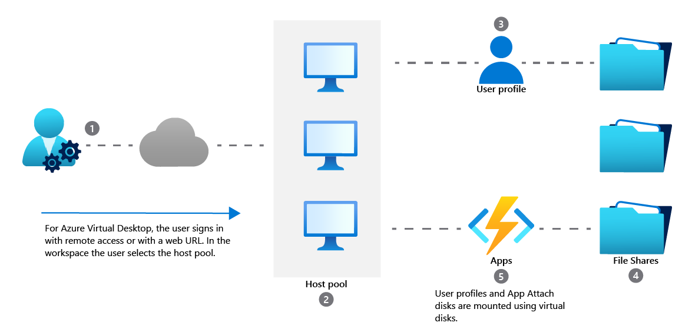

# AZ-140: Azure Virtual Desktop Speciality - MSLearn notes

## Index

- [AZ-140: Azure Virtual Desktop Speciality - MSLearn notes](#az-140-azure-virtual-desktop-speciality---mslearn-notes)
  - [Index](#index)
  - [Plan Azure Virtual Desktop implementation](#plan-azure-virtual-desktop-implementation)
    - [Architecture](#architecture)
      - [Components](#components)
      - [Limitations](#limitations)
      - [Virtual Machine Sizing](#virtual-machine-sizing)
        - [Recommendations - VM Sizing](#recommendations---vm-sizing)
    - [Design the architecture](#design-the-architecture)
      - [Network capacity and speed requirements](#network-capacity-and-speed-requirements)
        - [Applications](#applications)
        - [Display](#display)
      - [Balancing host pools](#balancing-host-pools)
    - [Design for user identities and profiles](#design-for-user-identities-and-profiles)
      - [Supported identity scenarios: User profiles](#supported-identity-scenarios-user-profiles)
      - [Licensing and supported Operating systems](#licensing-and-supported-operating-systems)
      - [Recommend an appropriate storage solution](#recommend-an-appropriate-storage-solution)
        - [FSLogix Profiles](#fslogix-profiles)
          - [Storage options comparison for FSLogix](#storage-options-comparison-for-fslogix)
          - [Storage recommendations - User profiles](#storage-recommendations---user-profiles)
        - [Applications (App Attach)](#applications-app-attach)
          - [Recommendations (App Attach)](#recommendations-app-attach)
      - [Plan for desktop client deployment](#plan-for-desktop-client-deployment)
        - [Clients](#clients)
        - [Workspaces](#workspaces)
  - [Business continuity and disaster recovery](#business-continuity-and-disaster-recovery)
    - [BCDR plan](#bcdr-plan)
      - [Host pools](#host-pools)
  - [Deploy Azure Virtual Desktop](#deploy-azure-virtual-desktop)
    - [Automatic workspace discovery for clients](#automatic-workspace-discovery-for-clients)
    - [Deploy applications by using MSIX app attach](#deploy-applications-by-using-msix-app-attach)
      - [Creating an MSIX package](#creating-an-msix-package)
      - [MSIX Packaging Tool](#msix-packaging-tool)
      - [MSIX App Attach](#msix-app-attach)
        - [App Attach stages](#app-attach-stages)
        - [App Attach Terminology](#app-attach-terminology)
      - [Deploy and configure FSLogix](#deploy-and-configure-fslogix)
        - [FSLogix registry keys on session hosts](#fslogix-registry-keys-on-session-hosts)
        - [FSLogix NTFS permissions set](#fslogix-ntfs-permissions-set)
  - [Deliver remote desktops and apps with Azure Virtual Desktop](#deliver-remote-desktops-and-apps-with-azure-virtual-desktop)
    - [Secure an Azure Virtual Desktop Deployment](#secure-an-azure-virtual-desktop-deployment)
      - [Security best practices](#security-best-practices)
      - [AppLocker](#applocker)
  - [Implement an Azure Virtual Desktop infrastructure](#implement-an-azure-virtual-desktop-infrastructure)
    - [Create a managed virtual machine (VM) image](#create-a-managed-virtual-machine-vm-image)
      - [Customize image](#customize-image)
      - [Create a virtual machine from a managed image](#create-a-virtual-machine-from-a-managed-image)
      - [Plan for image update and management](#plan-for-image-update-and-management)
      - [Azure Compute Gallery limits](#azure-compute-gallery-limits)
      - [Azure Computer Gallery Scaling](#azure-computer-gallery-scaling)
    - [Create and manage session host image for Azure Virtual Desktop](#create-and-manage-session-host-image-for-azure-virtual-desktop)
      - [Create an Azure Virtual Desktop image by using VM Image Builder](#create-an-azure-virtual-desktop-image-by-using-vm-image-builder)
        - [Windows 10 images](#windows-10-images)
        - [Cmdlets used](#cmdlets-used)
      - [Install Microsoft 365 Apps on a master Virtual Hard Disk image](#install-microsoft-365-apps-on-a-master-virtual-hard-disk-image)
        - [Sample configuration.xml](#sample-configurationxml)
        - [Install OneDrive in per-machine mode](#install-onedrive-in-per-machine-mode)
    - [Install language packs in Azure Virtual Desktop](#install-language-packs-in-azure-virtual-desktop)
  - [Manage access and security for Azure Virtual Desktop](#manage-access-and-security-for-azure-virtual-desktop)
    - [Manage access for Azure Virtual Desktop](#manage-access-for-azure-virtual-desktop)
      - [Azure Virtual Desktop roles](#azure-virtual-desktop-roles)

## Plan Azure Virtual Desktop implementation

### Architecture


#### Components

- **Host pools** - Host pools are a collection of one or more identical virtual machines (VMs) within Azure Virtual Desktop environments. Each host pool can contain an app group that users can interact with as they would on a physical desktop. Users obtain access to host pools by being allocated to a host pool using an assigned Application Group. There are two types of host pools.
  - **Pooled:** You can configure a pooled host pool for several users to sign in and share a VM. Typically, none of those users would be a local administrator on the pooled VM. With pooled, you can use one of the recommended images that includes Windows 10 Enterprise multi-session. This operating system is exclusive to Azure Virtual Desktop. You can also use your own custom image. Pooled desktop solutions assign users to whichever session host is currently available, depending on the load-balancing algorithm. Because the users don't always return to the same session host each time they connect, they have limited ability to customize the desktop environment and don't usually have administrator access.
  - **Personal:** A personal host pool is where each user has their own dedicated VM. Those users would typically be local administrators for the VM. This enables the user to install or uninstall apps without impacting other users. Personal desktop solutions (sometimes called persistent desktops) allow users to always connect to the same specific session host. Users can typically modify their desktop experience to meet personal preferences, and save files in the desktop environment. Personal desktop solutions:
    - Let users customize their desktop environment, including user-installed applications and saving files within the desktop environment.
    - Allow assigning dedicated resources to a specific user, which can be helpful for some manufacturing or development use cases.

#### Limitations

| **Azure Virtual Desktop object** | **Per Parent container object**  | **Service limit** |
|----------------------------------|----------------------------------|-------------------|
| Workspace                        | Microsoft Entra tenant           | 1300              |
| HostPool                         | Workspace                        | 400               |
| Application group                | Microsoft Entra tenant           | 500               |
| RemoteApp                        | Application group                | 500               |
| Role assignment                  | Any Azure Virtual Desktop object | 200               |
| Session host                     | HostPool                         | 10,000            |

#### Virtual Machine Sizing


VM sizing is an important consideration when you deploy Azure Virtual Desktop. Sizing directly affects your cost and end-user experience. Sizing also determines which workloads run smoothly. The overall goal is to right-size your VMs by looking at factors like the resource requirements of your workload and whether you use personal or pooled host pools. It's also preferable to use a larger number of smaller VMs than to use a few large VMs, because it's easier to manage and maintain smaller VMs. For detailed information about VM sizing, see Session host virtual machine sizing guidelines.

Scaling plans provide an efficient way of using small, low-user-density VMs. A scaling plan automatically adjusts the number of VMs based on user demand and schedule. This approach reduces costs by turning off unused VMs. It optimizes resources by matching host pool capacity with user sessions. For more information, see Autoscale scaling plans and example scenarios in Azure Virtual Desktop.

When you select an operating system disk for Azure Virtual Desktop, you can save costs by selecting a standard hard-disk drive (HDD) over a solid-state drive (SSD), but you sacrifice performance. If your production workload requires a service-level agreement (SLA), you should use premium SSD storage.

Another consideration is that Azure VMs have I/O operations per second (IOPS) and throughput performance limits that are based on the VM type and size. The selected SKU of operating system disks and data disks ultimately determines the IOPS that are available to the user. If you use FSLogix profiles, you have extra IOPS requirements, because the profiles are pulled from network shares and written to disk. For detailed information about IOPS and disk performance, see Scalability and performance targets for VM disks.

##### Recommendations - VM Sizing

- Examine the CPU, GPU, memory, and storage usage of the workloads that your users run before you select a VM SKU.
- Use VMs with at least two physical CPU cores for single-session hosts.
- Use VMs with at least four cores for multiple-session hosts.
- Use a larger number of smaller VMs instead of a few large VMs.
- Use scaling plans to adjust your number of VMs based on user demand and schedule.
- Take into account the IOPS and throughput performance limits of your VMs when you select a disk type.
- Use SSDs for high-performance workloads.
- Use premium SSDs for production workloads that require high performance, low latency, and an SLA.
- Use premium SSDs for Windows 10 or Windows 11 Enterprise Multi-Session.
- Use standard or premium SSDs for personal desktops.

### Design the architecture

#### Network capacity and speed requirements

##### Applications

| **Workload type** | **Recommended bandwith** |
|-------------------|--------------------------|
| Light             | 1.5 Mbps                 |
| Medium            | 3 Mbps                   |
| Heavy             | 5 Mbps                   |
| Power             | 15 Mbps                  |

##### Display

| **Typical display resolutions at 30 fps** | **Recommended bandwidth** |
|-------------------------------------------|---------------------------|
| About 1024 × 768 px                       | 1.5 Mbps                  |
| About 1280 × 720 px                       | 3 Mbps                    |
| About 1920 × 1080 px                      | 5 Mbps                    |
| About 3840 × 2160 px (4K)                 | 15 Mbps                   |

#### Balancing host pools

The following load-balancing methods are available in Azure Virtual Desktop:

- **Breadth-first load balancing** allows you to evenly distribute user sessions across the session hosts in a host pool.
- **Depth-first load balancing** allows you to saturate a session host with user sessions in a host pool. Once the first session reaches its session limit threshold, the load balancer directs any new user connections to the next session host in the host pool until it reaches its limit, and so on.

### Design for user identities and profiles

#### Supported identity scenarios: User profiles

| **Identity scenario**                                        | **Session hosts**                         | **User accounts**                                                       |
|--------------------------------------------------------------|-------------------------------------------|-------------------------------------------------------------------------|
| Microsoft Entra ID + AD DS                                   | Joined to AD DS                           | In Microsoft Entra ID and AD DS, synchronized                           |
| Microsoft Entra ID + AD DS                                   | Joined to Microsoft Entra ID              | In Microsoft Entra ID and AD DS, synchronized                           |
| Microsoft Entra ID + Microsoft Entra Domain Services         | Joined to Microsoft Entra Domain Services | In Microsoft Entra ID and Microsoft Entra Domain Services, synchronized |
| Microsoft Entra ID + Microsoft Entra Domain Services + AD DS | Joined to Microsoft Entra Domain Services | In Microsoft Entra ID and AD DS, synchronized                           |
| Microsoft Entra ID + Microsoft Entra Domain Services         | Joined to Microsoft Entra ID              | In Microsoft Entra ID and Microsoft Entra Domain Services, synchronized |
| Microsoft Entra-only                                         | Joined to Microsoft Entra ID              | In Microsoft Entra ID                                                   |

#### Licensing and supported Operating systems

| **Operating system (64-bit only)**                                                                                  | **Licensing method (Internal commercial purposes)**                                                                                             | **Licensing method (External commercial purposes)**                                                                                   |
|---------------------------------------------------------------------------------------------------------------------|-------------------------------------------------------------------------------------------------------------------------------------------------|---------------------------------------------------------------------------------------------------------------------------------------|
| Windows 11 Enterprise multi-session Windows 11 Enterprise Windows 10 Enterprise multi-session Windows 10 Enterprise | Microsoft 365 E3, E5, A3, A5, F3, Business Premium, Student Use Benefit Windows Enterprise E3, E5 Windows Education A3, A5 Windows VDA per user | Per-user access pricing by enrolling an Azure subscription.                                                                           |
| Windows Server 2022 Windows Server 2019 Windows Server 2016                                                         | Remote Desktop Services (RDS) Client Access License (CAL) with Software Assurance (per-user or per-device) RDS User Subscription Licenses.      | Windows Server 2022 RDS Subscriber Access License (SAL).Per-user access pricing isn't available for Windows Server operating systems. |

#### Recommend an appropriate storage solution

##### FSLogix Profiles

To use [FSLogix Profile Container](https://learn.microsoft.com/en-us/fslogix/configure-profile-container-tutorial) when joining your session hosts to Microsoft Entra ID, you need to [store profiles on Azure Files](https://learn.microsoft.com/en-us/azure/virtual-desktop/create-profile-container-azure-ad) or [Azure NetApp Files](https://learn.microsoft.com/en-us/azure/virtual-desktop/create-fslogix-profile-container) and your user accounts must be hybrid identities. You must create these accounts in AD DS and synchronize them to Microsoft Entra ID. To learn more about deploying FSLogix Profile Container with different identity scenarios, see the following articles:

- [Set up FSLogix Profile Container with Azure Files and Active Directory Domain Services or Microsoft Entra Domain Services.](https://learn.microsoft.com/en-us/azure/virtual-desktop/fslogix-profile-container-configure-azure-files-active-directory)
- [Set up FSLogix Profile Container with Azure Files and Microsoft Entra ID.](https://learn.microsoft.com/en-us/azure/virtual-desktop/create-profile-container-azure-ad)
- [Set up FSLogix Profile Container with Azure NetApp Files](https://learn.microsoft.com/en-us/azure/virtual-desktop/create-fslogix-profile-container)

###### Storage options comparison for FSLogix

| **Features**            | **Azure Files**                                                                        | **Azure NetApp Files**                                                                                                                                                                                                          |
|-------------------------|----------------------------------------------------------------------------------------|---------------------------------------------------------------------------------------------------------------------------------------------------------------------------------------------------------------------------------|
| Use case                | General purpose                                                                        | General purpose to enterprise scale                                                                                                                                                                                             |
| Platform service        | Yes, Azure-native solution                                                             | Yes, Azure-native solution                                                                                                                                                                                                      |
| Regional availability   | All regions                                                                            | Selected regions                                                                                                                                                                                                                |
| Redundancy              | Locally redundant, zone-redundant, geo-redundant, or geo-zone-redundant                | Locally redundant, zone-redundant with cross-zone replication, or geo-redundant with cross-region replication                                                                                                                   |
| Tiers                   | Standard (transaction optimized), premium                                              | Standard, premium, ultra                                                                                                                                                                                                        |
| Performance             | Up to a maximum of 100,000 IOPS per share with 10 GBps per share at about 3-ms latency | Up to a maximum of 460,000 IOPS per volume with 4.5 GBps per volume at about 1-ms latency. For IOPS and performance details, see Performance considerations for Azure NetApp Files and Performance FAQs for Azure NetApp Files. |
| Capacity                | 100 TiB per share, up to 5 PiB per general purpose account                             | 100 TiB per volume, up to 12.5 PiB per NetApp account                                                                                                                                                                           |
| Required infrastructure | A minimum share size of 1 GiB                                                          | A minimum capacity pool of 2 TiB, a minimum volume size of 100 GiB                                                                                                                                                              |
| Protocols               | Network File System (NFS) 4.1 (preview), Server Message Block (SMB) 3.0, SMB 2.1, REST | NFS 4.1, NFS 3, SMB 3.x, SMB 2.x, dual-protocol                                                                                                                                                                                 |

###### Storage recommendations - User profiles

- Use FSLogix as your user profile solution for Azure Virtual Desktop.
- Deploy your storage solution for FSLogix profile containers in the same region as your session hosts.
- Check that any storage solution that you're considering supports the protocols that you use.
- Use Azure Files as your storage solution in most scenarios. Consider the following guidelines when you select a tier:
  - Use premium file shares for I/O-intensive workloads that require high performance and low latency.
  - Use standard file shares for I/O workloads that are less sensitive to performance variability.
  - Use standard file shares for a pay-as-you-go billing model.
- Consider using Azure NetApp Files as a storage solution for large-scale Azure Virtual Desktop deployments. Keep the following points in mind:
  - Check that Azure NetApp Files is available in your region.
  - Consider costs and performance requirements when you select a tier and provision capacity.
  - Be aware that the capacity that you provision can affect your choice of tier.

##### Applications (App Attach)

App Attach is the recommended solution for delivering applications to Azure Virtual Desktop VMs. It offers many benefits for packaging and app management. Examples include increased security, flexibility, and control, and reduced deployment time. For example, you can use App Attach to update apps without affecting user data or settings. It supports desktop and Universal Windows Platform (UWP) apps. App Attach also provides a way for you to use the Windows app installer to install and uninstall apps easily.

App Attach is different from MSIX. App Attach is designed specifically for supported products like Azure Virtual Desktop. In an Azure Virtual Desktop deployment, App Attach delivers apps to session hosts within MSIX containers. These containers separate user data, the operating system, and apps. This separation improves security and increases troubleshooting efficiency. A main benefit of App Attach is that it offers flexibility and control over app delivery. For instance, you can dynamically attach apps from an MSIX package to a user session.

App Attach doesn't have specific dependencies on the type of storage fabric that the file share uses. As a result, the considerations for the App Attach share are the same as the considerations for an FSLogix share. For those considerations, see [User profiles](https://learn.microsoft.com/en-us/azure/well-architected/azure-virtual-desktop/storage#user-profiles). To learn more about storage requirements, see [Storage options for FSLogix profile containers in Azure Virtual Desktop.](https://learn.microsoft.com/en-us/azure/virtual-desktop/store-fslogix-profile)

###### Recommendations (App Attach)

- Separate the App Attach storage fabric from FSLogix profile containers.
- Exclude the following files from antivirus scans to avoid performance bottlenecks:
  - `<App-Attach-file-share>*.VHD`
  - `<App-Attach-file-share>*.VHDX`
  - `<App-Attach-file-share>.CIM`
- Exclude the following locations from antivirus scans if you use Azure Files:
  - \storageaccount.file.core.windows.net\share*.VHD
  - \storageaccount.file.core.windows.net\share*.VHDX
  - \storageaccount.file.core.windows.net\share*.CIM
- Run a test if you use a multiple-session host to see whether two or more users on the same session host can successfully run the app at the same time.
- Include steps in your disaster recovery plans for Azure Virtual Desktop for replicating your App Attach file share in your secondary failover location. Also ensure that the file share path is accessible in the secondary location. Consider using a distributed file system (DFS) namespace to meet this requirement.
- Check that the App Attach file share contains the following permissions when you use Azure Files:

| Azure object                        | Required role                                    | Role function                                                                                                                        |
|-------------------------------------|--------------------------------------------------|--------------------------------------------------------------------------------------------------------------------------------------|
| Session hosts (VM computer objects) | Storage File Data SMB Share Reader               | Provides read access to Azure file shares over SMB                                                                                   |
| Admins on file shares               | Storage File Data SMB Share Elevated Contributor | Provides read, write, and delete access and permissions to modify access control lists on files and directories in Azure file shares |

#### Plan for desktop client deployment

##### Clients

| **Platform**                                                                                  |
|-----------------------------------------------------------------------------------------------|
| Windows                                                                                       |
| - Remote Desktop client (MSI)                                                                 |
| - Azure Virtual Desktop Store app                                                             |
| - Remote Desktop Store app                                                                    |
| Web                                                                                           |
| macOS                                                                                         |
| iOS/iPadOS                                                                                    |
| Android/Chrome OS                                                                             |

##### Workspaces


## Business continuity and disaster recovery

### BCDR plan

- Region pairing

- Availability set

  

- Availability zones

  

- Azure Site Recovery

  

#### Host pools

Can be configured in active-active or active-passive configurations.

- **Active-active:** With an active-active configuration, a single host pool can have VMs from multiple regions. You must combine cloud cache features to actively replicate a user's FSLogix profile across storage in multiple regions. For MSIX app attach, use another copy on an additional file share in the other region. VMs in each region should contain the Cloud cache registry to specify the locations. Additionally, you must configure the Group Policies to give precedence to the local storage location. This Azure Virtual Desktop deployment provides the highest efficiency from a user perspective. This is because if there's a failure, users in the remaining region can continue to use the service without having to sign in again. However, this configuration is more costly and more complex to deploy and isn't optimized for performance.

- **Active-passive:** For an active-passive configuration, you can use Azure Site Recovery to replicate your VMs in the secondary region with your domain controllers. If you use Azure Site Recovery, you don't need to register the VMs manually. Instead, the Azure Virtual Desktop agent in the secondary VM automatically uses the latest security token to connect to the service instance closest to it. This ensures that your session host joins the host pool automatically, and the user needs to reconnect only to access their VMs. For this configuration, you can also create a secondary host pool (known as a hot standby) in the failover region with all the resources turned off. You can then use a recovery plan in Azure Site Recovery to turn on host pools and create an orchestrated process. You also need to create a new application group in the failover region and assign users to them.

## Deploy Azure Virtual Desktop

### Automatic workspace discovery for clients

To simplify the process for your users, set up email discovery with your domain registrar. Add a DNS TXT record that has the following properties for the domain associated with your email:

| **Property** | **Value**                                                                     |
|--------------|-------------------------------------------------------------------------------|
| Host         | `_msradc`                                                                     |
| Text         | `https://rdweb.wvd.microsoft.com/api/arm/feeddiscovery/webfeeddiscovery.aspx` |
| TTL          | `300`                                                                         |

### Deploy applications by using MSIX app attach

#### Creating an MSIX package

You can create an MSIX package by using one of two methods:

- Repackaging existing Win32 installers
- Generating MSIX from source code

#### MSIX Packaging Tool

You can use the MSIX Packaging Tool to create an MSIX application package from any of the following installers:

- MSI
- EXE
- ClickOnce
- App-V
- Script
- Manual installation

#### MSIX App Attach



##### App Attach stages

| **Term**             | **Definition**                                                                                                                                                                      |
|----------------------|-------------------------------------------------------------------------------------------------------------------------------------------------------------------------------------|
| Stage                | MSIX app attach notifies the operating system that an application is available, and that the virtual disk that contains the MSIX package (also known as the MSIX image) is mounted. |
| Registration         | MSIX app attach uses a per-user process to make the application available to you.                                                                                                   |
| Delayed registration | Complete registration of the application is delayed until you decide to run the application.                                                                                        |
| Deregistration       | The application is no longer available to you after you sign out.                                                                                                                   |
| Destage              | The application is no longer available from the virtual machine after shutdown or restart of the machine.                                                                           |

##### App Attach Terminology

| **Term**         | **Definition**                                                                                   |
|------------------|--------------------------------------------------------------------------------------------------|
| MSIX container   | The place where MSIX apps run. The container is lightweight and isolated from other apps.        |
| MSIX application | An application that's packaged in MSIX format with an MSIX extension.                            |
| MSIX package     | The package that contains the payload of the application with additional files.                  |
| MSIX image       | A VHD, VHDX, or Composite Image (CIM) file that contains one or more MSIX packaged applications. |
| Repackage        | The process to convert a non-MSIX application into MSIX by using the MSIX Packaging tool.        |

#### Deploy and configure FSLogix

##### FSLogix registry keys on session hosts

| **Type**           | **Name**     | **Data/Value**                                          |
|--------------------|--------------|---------------------------------------------------------|
| DWORD              | Enabled      | 1                                                       |
| Multi-String Value | VHDLocations | File share location from Azure Files in SMB path format |

| **Type** | **Name** | **Data/Value** |
|----------|----------|----------------|
| DWORD    | Enabled  | 1              |

##### FSLogix NTFS permissions set

Map the storage account as a drive on the session host:

```powershell
net use <desired-drive-letter>: \\<storage-account-name>.file.core.windows.net\<share-name> <storage-account-key> /user:Azure\<storage-account-name>
```

For example:

```powershell
net use y: \\fsprofile.file.core.windows.net\share HDZQRoFP2BBmoYQ(truncated)== /user:Azure\fsprofile
```

Run the following commands to set permissions on the share that allow your Azure Virtual Desktop users to create their own profile while blocking access to the profiles of other users.

```powershell
icacls <mounted-drive-letter>: /grant "<DOMAIN\GroupName>:(M)"
icacls <mounted-drive-letter>: /grant "Creator Owner:(OI)(CI)(IO)(M)"
icacls <mounted-drive-letter>: /remove "Authenticated Users"
icacls <mounted-drive-letter>: /remove "Builtin\Users"
```

For example

```powershell
icacls y: /grant "CONTOSO\AVDUsers:(M)"
icacls y: /grant "Creator Owner:(OI)(CI)(IO)(M)"
icacls y: /remove "Authenticated Users"
icacls y: /remove "Builtin\Users"
```

## Deliver remote desktops and apps with Azure Virtual Desktop

### Secure an Azure Virtual Desktop Deployment

#### Security best practices

| **Best practice**                                                                             | **Result**                                                                                                                                                 |
|-----------------------------------------------------------------------------------------------|------------------------------------------------------------------------------------------------------------------------------------------------------------|
| Enable Microsoft Defender for Cloud for its cloud security posture management (CSPM) features | Use the CSPM feature of the security score to improve your overall security.                                                                               |
| Require multifactor authentication                                                            | Enhance user authentication.                                                                                                                               |
| Enable Conditional Access                                                                     | Manage risks before you grant users access.                                                                                                                |
| Collect audit logs                                                                            | Review user and administrator activity.                                                                                                                    |
| Use RemoteApp                                                                                 | Reduce risk by letting the user work with only a subset of the remote machine exposed.                                                                     |
| Monitor usage with Azure Monitor                                                              | Create service health alerts to receive notifications for the Azure Virtual Desktop service.                                                               |
| Enable endpoint protection                                                                    | Protect your deployment from known malware.                                                                                                                |
| Install an endpoint detection and response (EDR) product                                      | Use EDR to provide advanced detection and response capabilities.                                                                                           |
| Enable threat and vulnerability management assessments                                        | Help identify problem spots through vulnerability assessments for server operating systems.                                                                |
| Fix software vulnerabilities in your environment                                              | When a vulnerability is identified, on-premises or in a virtual environment, you must fix it.                                                              |
| Establish maximum inactive time and disconnection policies                                    | Sign out users when they're inactive to preserve resources and prevent unauthorized access.                                                                |
| Lock setup screen for idle sessions                                                           | Prevent unwanted system access by configuring Azure Virtual Desktop to lock a machine's screen during idle time and requiring authentication to unlock it. |
| Don't grant your users administrator access to virtual desktops                               | Manage software packages by using Configuration Manager.                                                                                                   |
| Consider which users should access which resources                                            | Limit host connection to internet resources.                                                                                                               |
| Restrict operating system capabilities                                                        | Strengthen the security of your session hosts.                                                                                                             |
| In the Azure Virtual Desktop host pools, limit device redirection under RDP properties        | Prevent data leakage.                                                                                                                                      |

#### AppLocker

It's recommended to use AppLocker as part of overall application control strategy. It allows predefined applications to run on your systems.

AppLocker control policies restriction rules are based on:

- File attributes such as the digital signature
- Product name
- File name
- File version

## Implement an Azure Virtual Desktop infrastructure

### Create a managed virtual machine (VM) image

#### Customize image

Windows 10 Enterprise multi-session is available in the Azure Image Gallery. There are two options for customizing this image.

- The first option is to provision a virtual machine in Azure.
- The second option is to create the image locally by downloading the image, provisioning a Hyper-V virtual machine, and customizing it to suit your needs.

#### Create a virtual machine from a managed image

Before creating a new virtual machine, create a managed virtual machine image to use as the source image and grant read access on the image to any user who should have access to the image.

One managed image supports up to 20 simultaneous deployments. Attempting to create more than 20 virtual machines concurrently, from the same managed image, may result in provisioning timeouts due to the storage performance limitations of a single VHD. To create more than 20 virtual machines concurrently, use a Shared Image Galleries image configured with 1 replica for every 20 concurrent virtual machine deployments.

#### Plan for image update and management

The Azure Compute Gallery lets you share your custom VM images with others in your organization, within or across regions, within a Microsoft Entra tenant. Choose the images you want to share, the regions you want to make them available in, and who you want to share them with. You can create multiple galleries so that you can logically group shared images.

The gallery is a top-level resource that provides full Azure role-based access control (RBAC). Images can be versioned, and you can choose to replicate each image version to a different set of Azure regions. The gallery only works with Managed Images.

Azure Compute Gallery is a service that helps you build structure and organization around images. Azure Compute Gallery provides:

- Global replication of images.
- Versioning and grouping of images for easier management.
- Highly available images with Zone Redundant Storage (ZRS) accounts in regions that support Availability Zones. ZRS offers better resilience against zonal failures.
- Premium storage support (Premium_LRS).
- Sharing across subscriptions, and even between Active Directory (AD) tenants, using role-based access control (RBAC).
- Scaling your deployments with image replicas in each region.

#### Azure Compute Gallery limits

There are limits, per subscription, for deploying resources using Azure Compute Galleries:

- 100 shared image galleries, per subscription, per region.
- 1,000 image definitions, per subscription, per region.
- 10,000 image versions, per subscription, per region.
- 10 image version replicas, per subscription, per region.
- Any disk attached to the image must be less than or equal to 1TB in size.

#### Azure Computer Gallery Scaling

With Azure Compute Gallery, you can now deploy up to a 1,000 VM instances in a virtual machine scale set (up from 600 with managed images). Image replicas provide for better deployment performance, reliability, and consistency. You can set a different replica count in each target region, based on the scale needs for the region. Since each replica is a deep copy of your image, replicas help scale your deployments linearly with each extra replica. While we understand no two images or regions are the same, here’s our general guideline on how to use replicas in a region:

- For non-Virtual Machine Scale Set deployments - For every 20 VMs that you create concurrently, we recommend you keep one replica. For example, if you're creating 120 VMs concurrently using the same image in a region, we suggest you keep at least 6 replicas of your image.
- For Virtual Machine Scale Set deployments - For every scale set deployment with up to 600 instances, we recommend you keep at least one replica. For example, if you're creating 5 scale sets concurrently, each with 600 VM instances using the same image in a single region, we suggest you keep at least 5 replicas of your image.

### Create and manage session host image for Azure Virtual Desktop

#### Create an Azure Virtual Desktop image by using VM Image Builder

##### Windows 10 images

Below the different settings for multi-session and single-session Windows 10 images:

Multi:

```json
"publisher": "MicrosoftWindowsDesktop",
"offer": "Windows-10",
"sku": "20h2-evd",
"version": "latest"
```

Single:

```json
"publisher": "MicrosoftWindowsDesktop",
"offer": "Windows-10",
"sku": "19h2-ent",
"version": "latest"
```

##### Cmdlets used

- `New-AzGallery`
- `New-AzGalleryDefinition`
- `Start-AzImageBuilederTemplate`

For more information see: [Create an Azure Virtual Desktop image by using VM Image Builder | Microsoft Learn](https://learn.microsoft.com/en-us/training/modules/create-manage-session-host-image/6-create-azure-virtual-desktop-image-image-builder)

#### Install Microsoft 365 Apps on a master Virtual Hard Disk image

The Office Deployment Tool contains setup.exe. To install Office, run the following command in a command line:

```powershell
Setup.exe /configure configuration.xml
```

##### Sample configuration.xml

The following XML sample will install the Monthly Enterprise Channel release.

```xml
<Configuration>
<Add OfficeClientEdition="64" Channel="MonthlyEnterprise">
<Product ID="O365ProPlusRetail">
<Language ID="en-US" />
<Language ID="MatchOS" />
<ExcludeApp ID="Groove" />
<ExcludeApp ID="Lync" />
<ExcludeApp ID="OneDrive" />
<ExcludeApp ID="Teams" />
</Product>
</Add>
<RemoveMSI/>
<Updates Enabled="FALSE"/>
<Display Level="None" AcceptEULA="TRUE" />
<Logging Level="Standard" Path="%temp%\WVDOfficeInstall" />
<Property Name="FORCEAPPSHUTDOWN" Value="TRUE"/>
<Property Name="SharedComputerLicensing" Value="1"/>
</Configuration>
```

After installing Office, you can update the default Office behavior. Run the following commands individually or in a batch file to update the behavior.

```text
rem Mount the default user registry hive
reg load HKU\TempDefault C:\Users\Default\NTUSER.DAT
rem Must be executed with default registry hive mounted.
reg add HKU\TempDefault\SOFTWARE\Policies\Microsoft\office\16.0\common /v InsiderSlabBehavior /t REG_DWORD /d 2 /f
rem Set Outlook's Cached Exchange Mode behavior
rem Must be executed with default registry hive mounted.
reg add "HKU\TempDefault\software\policies\microsoft\office\16.0\outlook\cached mode" /v enable /t REG_DWORD /d 1 /f
reg add "HKU\TempDefault\software\policies\microsoft\office\16.0\outlook\cached mode" /v syncwindowsetting /t REG_DWORD /d 1 /f
reg add "HKU\TempDefault\software\policies\microsoft\office\16.0\outlook\cached mode" /v CalendarSyncWindowSetting /t REG_DWORD /d 1 /f
reg add "HKU\TempDefault\software\policies\microsoft\office\16.0\outlook\cached mode" /v CalendarSyncWindowSettingMonths  /t REG_DWORD /d 1 /f
rem Unmount the default user registry hive
reg unload HKU\TempDefault

rem Set the Office Update UI behavior.
reg add HKLM\SOFTWARE\Policies\Microsoft\office\16.0\common\officeupdate /v hideupdatenotifications /t REG_DWORD /d 1 /f
reg add HKLM\SOFTWARE\Policies\Microsoft\office\16.0\common\officeupdate /v hideenabledisableupdates /t REG_DWORD /d 1 /f
```

##### Install OneDrive in per-machine mode

OneDrive is normally installed per-user. In this environment, it should be installed per-machine.

- Run this command from an elevated command prompt to set the AllUsersInstall registry value:
  - `REG ADD "HKLM\Software\Microsoft\OneDrive" /v "AllUsersInstall" /t REG_DWORD /d 1 /reg:64`
- Run this command to install OneDrive in per-machine mode:
  - `Run "[staged location]\OneDriveSetup.exe" /allusers`
- Run this command to configure OneDrive to start at sign in for all users:
  - `REG ADD "HKLM\Software\Microsoft\Windows\CurrentVersion\Run" /v OneDrive /t REG_SZ /d "C:\Program Files (x86)\Microsoft OneDrive\OneDrive.exe /background" /f`
- Enable Silently configure user account by running the following command.
  - `REG ADD "HKLM\SOFTWARE\Policies\Microsoft\OneDrive" /v "SilentAccountConfig" /t REG_DWORD /d 1 /f`
- Redirect and move Windows known folders to OneDrive by running the following command.
  - `REG ADD "HKLM\SOFTWARE\Policies\Microsoft\OneDrive" /v "KFMSilentOptIn" /t REG_SZ /d "<your-AzureAdTenantId>" /f`

### Install language packs in Azure Virtual Desktop

You want your users be able to customize which language their Windows 10 Enterprise multi-session image displays.

There are two ways you can accommodate the language needs of your users:

- Build dedicated host pools with a customized image for each language.
- Have users with different language and localization requirements in the same host pool, but customize their images to ensure they can select whichever language they need.

The latter method is a lot more efficient and cost-effective. However, it's up to you to decide which method best suits your needs. This unit will show you how to customize languages for your images.

You need the following to customize Windows 10 Enterprise multi-session images to add multiple languages:

- An Azure virtual machine (VM) with Windows 10 Enterprise multi-session.
- The Language ISO, Feature on Demand (FOD) Disk 1, and Inbox Apps ISO of the OS version the image uses.
- An Azure Files Share or a file share on a Windows File Server Virtual Machine

The file share (repository) must be accessible from the Azure VM you plan to use to create the custom image.

## Manage access and security for Azure Virtual Desktop

### Manage access for Azure Virtual Desktop

#### Azure Virtual Desktop roles

- **Desktop Virtualization Contributor role:** Lets you manage all aspects of the deployment. However, it doesn't grant you access to compute resources. You'll also need the User Access Administrator role to publish app groups to users or user groups.
- **Desktop Virtualization Reader role:** Lets you view everything in the deployment but doesn't let you make any changes.
- **Desktop Virtualization User role:** The Desktop Virtualization User role allows users to use an application on a session host from an application group as a non-administrative user.
- **Desktop Virtualization Host Pool Contributor:** The Desktop Virtualization Host Pool Contributor role allows managing all aspects of a host pool. You also need the Virtual Machine Contributor role to create virtual machines and the Desktop Virtualization Application Group Contributor and Desktop Virtualization Workspace Contributor roles to deploy Azure Virtual Desktop using the portal, or you can use the Desktop Virtualization Contributor role.
- **Desktop Virtualization Host Pool Contributor role:** Allows you to manage all aspects of host pools, including access to resources. You'll need an extra contributor role, Virtual Machine Contributor, to create virtual machines. You will need AppGroup and Workspace contributor roles to create host pool using the portal or you can use Desktop Virtualization Contributor role.
- **Desktop Virtualization Host Pool Reader role:** Allows you to view everything in the host pool, but won't allow you to make any changes.
- **Desktop Virtualization Application Group Contributor role:** Lets you manage all aspects of app groups. If you want to publish app groups to users or user groups, you'll need the User Access Administrator role.
- **Desktop Virtualization Application Group Reader role:** Allows you to view everything in the app group and will not allow you to make any changes.
- **Desktop Virtualization Workspace Contributor role:** Allows you to manage all aspects of workspaces. To get information on applications added to the app groups, you'll also need to be assigned the Application Group Reader role.
- **Desktop Virtualization Workspace Reader role:** Lets you view everything in the workspace, but won't allow you to make any changes.
- **Desktop Virtualization Session Host Operator role:** Allows you to send messages, disconnect sessions, and use the "logoff" function to sign sessions out of the session host. However, this role doesn't let you perform session host management like removing session host, changing drain mode, and so on. This role can see assignments but can't modify admins. We recommend you assign this role to specific host pools. If you give this permission at a resource group level, the admin will have read permission on all host pools under a resource group.
- **Desktop Virtualization Power On Contributor** - The Desktop Virtualization Power On Contributor role is used to allow the Azure Virtual Desktop Resource Provider to start virtual machines.
- **Desktop Virtualization Power On Off Contributor** - The Desktop Virtualization Power On Off Contributor role is used to allow the Azure Virtual Desktop Resource Provider to start and stop virtual machines.
- **Desktop Virtualization Virtual Machine Contributor** - The Desktop Virtualization Virtual Machine Contributor role is used to allow the Azure Virtual Desktop Resource Provider to create, delete, update, start, and stop virtual machines.
