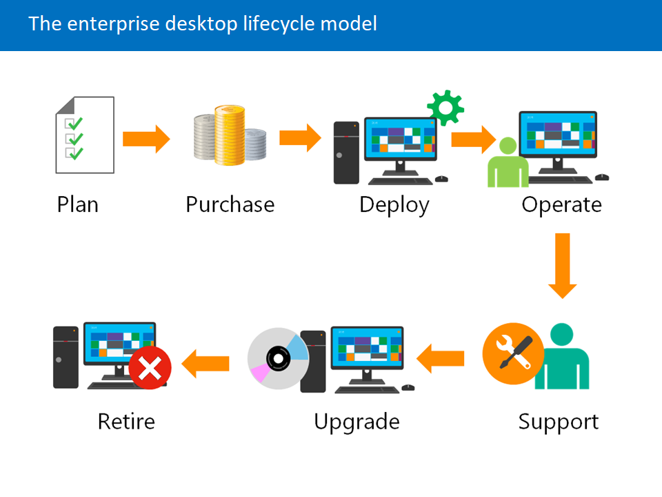
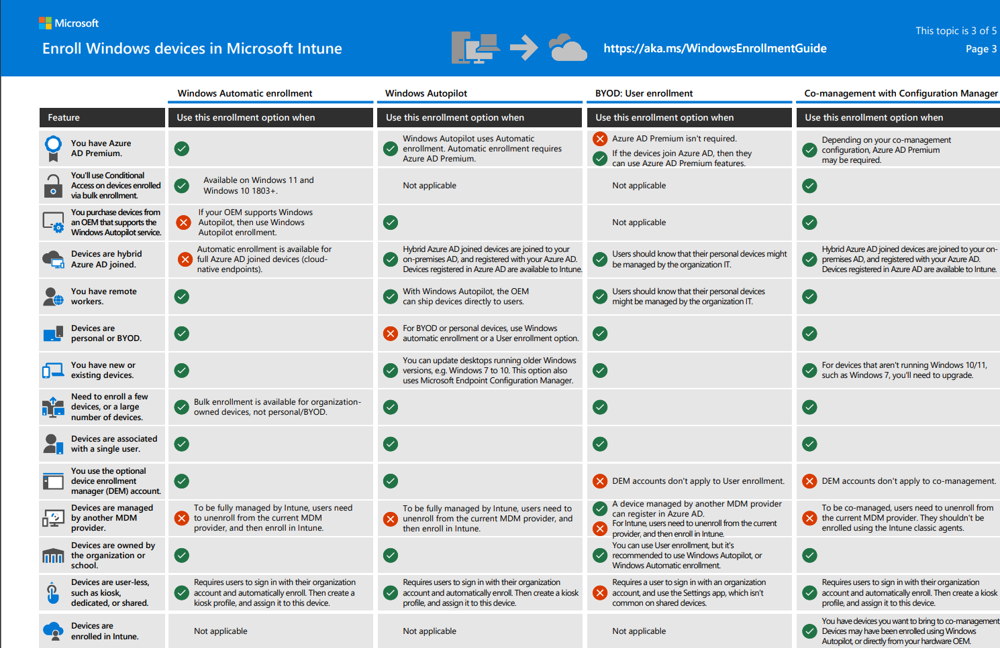

# MD-102: Endpoint Administrator Associate - MSLearn notes

## Index

- [MD-102: Endpoint Administrator Associate - MSLearn notes](#md-102-endpoint-administrator-associate---mslearn-notes)
  - [Index](#index)
  - [Explore endpoint management](#explore-endpoint-management)
    - [Explore the Enterprise Desktop](#explore-the-enterprise-desktop)
      - [Enterprise desktop lifecycle](#enterprise-desktop-lifecycle)
    - [Explore Windows Editions](#explore-windows-editions)
      - [Examine Windows client editions and capabilities](#examine-windows-client-editions-and-capabilities)
        - [Windows Pro](#windows-pro)
        - [Pro for Workstations](#pro-for-workstations)
        - [Enterprise additional features](#enterprise-additional-features)
        - [Enterprise LTSC](#enterprise-ltsc)
      - [OS requirements](#os-requirements)
  - [Execute device enrollment](#execute-device-enrollment)
    - [Manage device authentication](#manage-device-authentication)
      - [Microsoft Entra Join vs Entra registered vs Hybrid](#microsoft-entra-join-vs-entra-registered-vs-hybrid)
        - [Microsoft Entra registered devices](#microsoft-entra-registered-devices)
        - [Microsoft Entra joined devices](#microsoft-entra-joined-devices)
        - [Microsoft Entra hybrid joined devices](#microsoft-entra-hybrid-joined-devices)
    - [Enroll devices using Microsoft Intune](#enroll-devices-using-microsoft-intune)
      - [Device Management Lifecycle](#device-management-lifecycle)
      - [Supported devices](#supported-devices)
      - [Enrollment options](#enrollment-options)
        - [Windows](#windows)
      - [Simplify manual enrollment](#simplify-manual-enrollment)
        - [CNAME records](#cname-records)

## Explore endpoint management

### Explore the Enterprise Desktop

#### Enterprise desktop lifecycle

The phases:

- **Planning:** Preparing defining a strategy for system management.
- **Purchasing:** Processing requisitions, and then obtaining approval of invoices for payment.
- **Deployment:** Installing an operating system, enrolling devices, and deploying applications to the device.
- **Operations:** Ensuring that systems are functioning properly and are protected.
- **Support:** Ensuring that the end users learn how to use their systems and applications, and receive the support they need.
- **Upgrade and Retire:** This phase includes replacing devices, retiring obsolete hardware, or unenrolling a device from the organization.

### Explore Windows Editions

#### Examine Windows client editions and capabilities

| **Windows 10 / Windows 11 Edition** | **Audience**                                                                      | **Availability**                                                                                                                                                  |
|-------------------------------------|-----------------------------------------------------------------------------------|-------------------------------------------------------------------------------------------------------------------------------------------------------------------|
| Home                                | Individual home use                                                               | Everyone                                                                                                                                                          |
| Pro                                 | Small and mid-sized businesses, advanced users                                    | Everyone                                                                                                                                                          |
| Pro for Workstations                | Users with advanced performance and storage requirements                          | Everyone                                                                                                                                                          |
| Enterprise                          | Large enterprise organizations                                                    | Available to Volume LicenseMicrosoft Volume Licensing, Microsoft Enterprise Agreement, Microsoft Store for Education or Microsoft Cloud Solution Provider program |
| Enterprise LTSC                     | Large enterprise organizations with restrictive change requirements               | Microsoft Volume Licensing, Microsoft Enterprise Agreement, or Microsoft Cloud Solution Provider program                                                          |
| Pro Education                       | Comparable to Pro for school staff, administrators, teachers, and students        | Available to academic Volume License customers                                                                                                                    |
| Education                           | Comparable to Enterprise for school staff, administrators, teachers, and students | Available to academic Volume License customers                                                                                                                    |
| IoT Core/Enterprise                 | Fixed purpose and appliance devices                                               | Available through Windows IoT Distributors                                                                                                                        |

##### Windows Pro

Pro edition builds on the features of Windows Home, with many extra features to meet the needs of small and medium-sized businesses. Pro edition is also suitable for advanced consumers looking for features like BitLocker and virtualization.

Some of the features Pro edition provides:

- **Windows Autopilot:** Windows Autopilot uses an existing Windows installation to transform or reset the device to a “business-ready” state, applying settings, policies, apps, and edition changes without reimaging.
- **Dynamic Provisioning:** Dynamic Provisioning allows an organization's out-of-the-box PC to be configured with minimal effort.
- **Mobile Device Management (MDM) support:** Mobile Device Management support allows devices to be managed through an MDM service instead of traditional management solutions.
- **Domain Join:** Computers can join the Active Directory domain.
- **Ability to join Microsoft Entra ID:** This ability enables users to perform single sign-on across Windows, Microsoft 365, and other cloud-hosted apps and services.
- **Group Policy Management:** Domain joined computers support the Group Policy Management feature.
- **BitLocker:** BitLocker functions as a complete volume encryption and boot environment protection solution.
- **Windows Information Protection (with MDM management) helps protects apps and data leaks on organization and personally owned devices.
- **Assigned Access:** Allows devices to run different applications based on the user.
- **Remote Desktop:** This feature enables Remote Desktop connections from compatible Remote Desktop Connection clients.
- **Client Hyper-V:** Client Hyper-V allows you to host virtual machines on a client computer with sufficient hardware resources.
- **Microsoft Store for Business:** Single store for finding and managing apps in an organization.
- **Windows Update for Business:** A cloud-based Windows Update solution can configure distribution rings, maintenance windows, peer-to-peer delivery, and integration with tools like Microsoft Intune.
- **Enterprise Data Protection:** This new Windows feature lets organizations control which applications can access sensitive data.
- **Granular user-interface Control:** This feature enables administrators to lock the user interface so that users can perform specific tasks only. This feature is useful when deploying Windows as a kiosk.
- **Enterprise State Roaming:** Enterprise State Roaming provides users a unified experience across organizational Windows devices.

##### Pro for Workstations

Pro for Workstations edition offers the same features as the Pro edition. It includes more features intended for workloads that require higher performance and resilience.

- **ReFS (Resilient File System):** ReFS provides cloud-grade resiliency for data on fault-tolerant storage spaces and manages large volumes.
- **Persistent memory:** Support for non-volatile memory modules (NVDIMM-N). When turning off the workstation, data and files in memory persist.
- **SMB Direct:** SMB Direct supports network adapters that have Remote Direct Memory Access capability. SMB Direct offers improved performance when transferring large amounts of data on remote SMB file shares.
- **Expanded Hardware Support:** Expanded Hardware Support takes full advantage of high-performance hardware such as server-grade Intel Xeon and AMD Opteron processors, with support for up to 4 CPUs and 6 TB of memory.

##### Enterprise additional features

- **BranchCache:** Allows content from file and web servers on a wide area network (WAN) to be cached on computers at a local branch office.
- **Start menu layout control:** This feature enables you to use MDM policies or Group Policies to customize the appearance and content of the start menu.
- **Microsoft Defender Credential Guard:** Virtualization-based security isolates secrets, so only privileged users can access them.
- **Microsoft Defender Application Control:** Controls what applications run within your environment to help block against malware and untrusted apps.
- **Microsoft Defender Application Guard:** Opens untrusted websites in a Hyper-V container to isolate in case the site is malicious.
- **Microsoft Application Virtualization (App-V):** Enables organizations to deliver Win32 applications to users as virtual applications.
- **Microsoft User Experience Virtualization (UE-V):** Capture user-customized Windows and application settings and store them on a centrally managed network.
- **License rights:** For virtual desktops and edition step-up from Pro edition using cloud activation.
- **DirectAccess:** While this feature is supported, it’s recommended that organizations use “Always On VPN,” which is available in Pro, Enterprise, and Education editions.

##### Enterprise LTSC

- Doesn't receive feature upgrades
- No Microsoft Edge browser (can be installed separately)
- No Microsoft Store client
- Many built-in universal Windows apps are missing

#### OS requirements

- Windows 11 in 64-bit only
- **Processor:** 1 gigahertz (GHz) or faster with two or more cores on a compatible 64-bit processor or system on a chip (SoC).
- **RAM:** 4 gigabytes (GB) or greater.

## Execute device enrollment

### Manage device authentication

#### Microsoft Entra Join vs Entra registered vs Hybrid

##### Microsoft Entra registered devices

The goal of Microsoft Entra registered - also known as Workplace joined - devices is to provide your users with support for bring your own device (BYOD) or mobile device scenarios. In these scenarios, a user can access your organization's resources using a personal device.

| **Microsoft Entra registered** | **Description**                                                                                                                                                                                  |
|--------------------------------|--------------------------------------------------------------------------------------------------------------------------------------------------------------------------------------------------|
| Definition                     | Registered to Microsoft Entra ID without requiring organizational account to sign in to the device                                                                                               |
| Primary audience               | Applicable to all users with the following criteria:  - Bring your own device  - Mobile devices                                                                                                  |
| Device ownership               | User or Organization                                                                                                                                                                             |
| Operating Systems              | Windows 10 or newer, iOS, Android, macOS, Ubuntu 20.04/22.04 LTS                                                                                                                                 |
| Provisioning                   | - Windows 10 or newer – Settings - iOS/Android - Company Portal or Microsoft Authenticator app - macOS - Company Portal - Linux - Intune Agent                                                   |
| Device sign in options         | - End-user local credentials - Password - Windows Hello - PIN - Biometrics or pattern for other devices                                                                                          |
| Device management              | - Mobile Device Management (example: Microsoft Intune) - Mobile Application Management                                                                                                           |
| Key capabilities               | - Single Sign-On (SSO) to cloud resources - Conditional Access when enrolled into Intune - Conditional Access via App protection policy - Enables phone sign in with Microsoft Authenticator app |

##### Microsoft Entra joined devices

Any organization can deploy Microsoft Entra joined devices no matter the size or industry. Microsoft Entra join works even in hybrid environments, enabling access to both cloud and on-premises apps and resources.

| **Microsoft Entra join** | **Description**                                                                                                                                                                                                                          |
|--------------------------|------------------------------------------------------------------------------------------------------------------------------------------------------------------------------------------------------------------------------------------|
| Definition               | Joined only to Microsoft Entra ID requiring organizational account to sign in to the device                                                                                                                                              |
| Primary audience         | - Suitable for both cloud-only and hybrid organizations. - Applicable to all users in an organization                                                                                                                                    |
| Device ownership         | Organization                                                                                                                                                                                                                             |
| Operating Systems        | - All Windows 11 and Windows 10 devices except Home editions - Windows Server 2019 and newer Virtual Machines running in Azure (Server core isn't supported)                                                                             |
| Provisioning             | - Self-service: Windows Out of Box Experience (OOBE) or Settings - Bulk enrollment - Windows Autopilot                                                                                                                                   |
| Device sign in options   | Organizational accounts using:  - Password - Passwordless options like Windows Hello for Busienss and FIDO2.0 security keys.                                                                                                             |
| Device management        | - Mobile Device Management (example: Microsoft Intune) - Configuration Manager standalone or co-management with Microsoft Intune                                                                                                         |
| Key capabilities         | - Single Sign-On (SSO) to both cloud and on-premises resources - Conditional Access through mobile device management (MDM) enrollment and compliance evaluation - Self-service Password Reset and Windows Hello PIN reset on lock screen |

##### Microsoft Entra hybrid joined devices

Organizations with existing Active Directory implementations can benefit from some of the functionality provided by Microsoft Entra ID by implementing Microsoft Entra hybrid joined devices. These devices are joined to your on-premises Active Directory and registered with Microsoft Entra ID.

Microsoft Entra hybrid joined devices require network line of sight to your on-premises domain controllers periodically. Without this connection, devices become unusable. If this requirement is a concern, consider Microsoft Entra joining your devices.

| **Microsoft Entra hybrid join** | **Description**                                                                                                                                                                                                                  |
|---------------------------------|----------------------------------------------------------------------------------------------------------------------------------------------------------------------------------------------------------------------------------|
| Definition                      | Joined to on-premises Microsoft Windows Server Active Directory and Microsoft Entra ID requiring organizational account to sign in to the device                                                                                 |
| Primary audience                | - Suitable for hybrid organizations with existing on-premises Microsoft Windows Server Active Directory infrastructure - Applicable to all users in an organization                                                              |
| Device ownership                | Organization                                                                                                                                                                                                                     |
| Operating Systems               | - Windows 11 or Windows 10 except Home editions - Windows Server 2016, 2019, and 2022                                                                                                                                            |
| Provisioning                    | - Windows 11, Windows 10, Windows Server 2016/2019/2022 - Domain join by IT and autojoin via Microsoft Entra Connect or AD FS config - Domain join by Windows Autopilot and autojoin via Microsoft Entra Connect or AD FS config |
| Device sign in options          | Organizational accounts using:  - Password - Passwordless options like Windows Hello for Business and FIDO2.0 security keys.                                                                                                     |
| Device management               | - Group Policy - Configuration Manager standalon or co-management with Microsoft Intune                                                                                                                                          |
| Key capabilities                | - Single Sign-On (SSO) to both cloud and on-premises resources - Conditional Access through Domain join or through Intune if co-managed - Self-service Password Reset and Windows Hello PIN reset on lock screen                 |

Use Microsoft Entra hybrid joined devices if:

- You want to continue to use Group Policy to manage device configuration.
- You want to continue to use existing imaging solutions to deploy and configure devices.
- You have Win32 apps deployed to these devices that rely on Active Directory machine authentication.

### Enroll devices using Microsoft Intune

#### Device Management Lifecycle

- **Enroll:** In the Enroll phase, devices register with the mobile device management solution. With Intune, you can enroll both mobile devices, such as phones, and Windows PCs.
- **Configure:** In the Configure phase, you help to ensure that the enrolled devices are secure and that they comply with any configuration or security policies. You can also automate common administrative tasks, such as configuring Wi-Fi.
- **Protect:** In the Protect phase, the mobile device management solution provides ongoing monitoring of the settings established in the Configure phase. During this phase, you also use the mobile device management solution to help keep devices compliant through the monitoring and deployment of software updates.
- **Retire:** When a device is no longer needed, when it's lost, or when it's stolen, you should help to protect the data on the device. You can remove data by resetting the device, performing a full wipe, or performing a selective wipe that removes only corporation-owned data from the device.

#### Supported devices

- Windows 10/11 (Home, Pro, Education, S mode, and Enterprise versions)
- Windows 10/11 Cloud PCs on Windows 365
- Windows 10 IoT and Windows 10 Holographic
- Windows 10 2019 LTSC
- Surface Hub
- Windows 10 Teams (Surface Hub)
- Apple iOS/iPadOS 14.0 and later
- macOS 11.0 and later
- Android 8.0 and later, including Samsung KNOX Standard 3.0 and higher
- Linux Ubuntu Desktop (20.04 or 22.04 LTS on x86/64)
- Chrome OS

#### Enrollment options

Link to the enrollment guide: [https://aka.ms/WindowsEnrollmentGuide](https://aka.ms/WindowsEnrollmentGuide)

##### Windows

Enrolling Windows devices into Microsoft Intune for device management has many ways. Some are user-driven, and IT administrators control some. Some exist to support BYOD programs, and others to streamline modern provisioning scenarios and management for corporate-owned devices. Each enrollment method can have different setup requirements and behaviors. The following methods can be utilized to complete Intune enrollment:

- Method 1: Add work or school account
- Method 2: Enroll in MDM only (user driven)
- Method 3: Microsoft Entra join (OOBE)
- Method 4: Microsoft Entra join (Autopilot – user-driven deployment mode)
- Method 5: Microsoft Entra join (Autopilot self-deploying mode)
- Method 6: Enroll in MDM only (Device Enrollment Manager)
- Method 7: Configuration Manager co-management
- Method 8: Microsoft Entra join (bulk enrollment)

#### Simplify manual enrollment

If you don't have Microsoft Entra ID P1 or P2, you can create a domain name server (DNS) alias (CNAME record type) that redirects enrollment requests to Intune servers. While optional, if no CNAME record is found, users are prompted to manually enter the MDM server name, `enrollment.manage.microsoft.com`.

##### CNAME records

| **Type** | **Host name**                        | **Points to**                                 | **TTL (Time-To-Live)** |
|----------|--------------------------------------|-----------------------------------------------|------------------------|
| CNAME    | `EnterpriseEnrollment.contoso.com`   | `EnterpriseEnrollment-s.manage.microsoft.com` | 1 hour                 |
| CNAME    | `EnterpriseRegistration.contoso.com` | `EnterpriseRegistration.windows.net`          | 1 hour                 |
